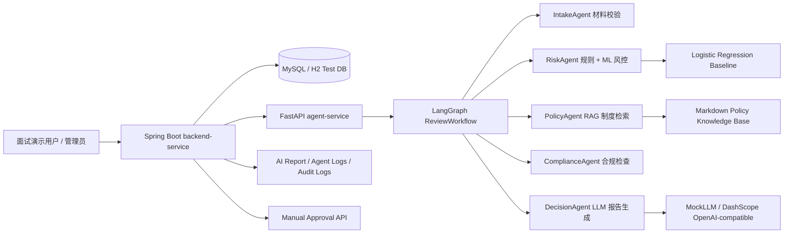

# Architecture

## 第 6 轮面试版架构总览



## Java 后端职责

- 客户管理：保存脱敏客户信息，不使用真实身份证、手机号或银行客户数据。
- 贷款申请：创建、提交、查询贷款申请。
- 状态流转：AI review 后最多进入 `AI_REVIEWED`，最终状态必须走人工审批。
- 触发 AI review：通过 HTTP 调用 Python `/api/v1/reviews`。
- 保存 AI report：将结构化 report JSON 入库，保留 risk、policy references 和 decision reasons。
- 保存 Agent execution logs：记录 Agent 名称、状态、耗时、输入/输出摘要和 LLM 生成元信息摘要。
- 人工审批：通过 approve/reject/need-more-info 接口写最终状态。
- 审计日志：记录登录、AI review、人工审批等关键操作。

## Python Agent 服务职责

- LangGraph 编排：按 IntakeAgent -> RiskAgent -> PolicyAgent -> ComplianceAgent -> DecisionAgent 执行。
- IntakeAgent：检查申请材料和基础字段完整性。
- RiskAgent：融合规则评分和 Logistic Regression baseline。
- PolicyAgent：基于本地 Markdown 制度库做 TF-IDF RAG 检索。
- ComplianceAgent：生成合规提示，强调 AI/ML 只作辅助。
- DecisionAgent：通过 LLM Provider 生成报告文本，并保留 fallback。
- LLM Provider：默认 Mock，可选 DashScope OpenAI-compatible，本地显式开启才会调用真实服务。

## 为什么是双服务架构

Java 更适合承载业务系统、权限、审批流程、数据库事务和审计留痕；Python 更适合 AI/ML/RAG/LangGraph 生态。两个服务通过 HTTP API 解耦，便于独立测试、独立替换 Agent 能力，也符合企业中 Java 业务系统接入 Python AI 服务的常见工程形态。

## 为什么用 LangGraph 而不只是 LangChain

LangGraph 适合状态化、多节点、可观测、可扩展的工作流编排；LangChain 更适合作为 LLM、retriever、embedding、tool 等组件集成层。本项目用 LangGraph 管理审批 Agent 流程，用可替换服务类预留 LangChain 生态组件接入能力。当前面试版使用固定顺序 workflow，后续可加入高风险、材料缺失、合规异常等 conditional edge。

## 审批边界

AI/ML/RAG/LLM 输出只作为审批辅助建议。系统不会让 LLM 改写 `risk_score`、`risk_level` 或数据库最终审批状态；最终 `APPROVED`、`REJECTED`、`NEED_MORE_INFO` 必须由人工审批接口确认。

## 双服务架构

SmartCreditMultiAgent 使用双服务架构：

- `backend-service`：Spring Boot 信贷业务系统，负责业务状态、持久化、审计和人工审批。
- `agent-service`：FastAPI + LangGraph 多 Agent 审批辅助服务，负责生成结构化 AI 审批建议。

## Java 后端职责

- 用户登录、JWT 和基础角色结构。
- 客户信息管理，只保存脱敏身份证和脱敏手机号。
- 贷款申请生命周期管理。
- 调用 Python Agent 服务。
- 保存 AI 审批报告、Agent 执行日志、人工审批记录和审计日志。
- 通过人工审批接口完成最终状态变更。

## Python Agent 服务职责

- 接收客户和贷款申请结构化信息。
- 使用 LangGraph 编排 `IntakeAgent -> RiskAgent -> PolicyAgent -> ComplianceAgent -> DecisionAgent`。
- 返回 `workflow_id`、风险等级、风险分、建议额度、摘要、Agent 执行结果和报告。

## 数据流

```text
Client -> backend-service -> MySQL
                       |
                       v
                 agent-service
                       |
                       v
        LangGraph multi-agent workflow
                       |
                       v
backend-service saves report/logs/audit and returns result
```

## 为什么用 LangGraph

LangGraph 适合表达有状态、多节点、可扩展条件分支的审批流程。第一轮使用固定顺序工作流，后续可在材料缺失、高风险、合规警告等节点加入 conditional edge。LangChain 只作为后续 LLM、Embedding、Retriever、向量库和结构化输出的组件集成层。
