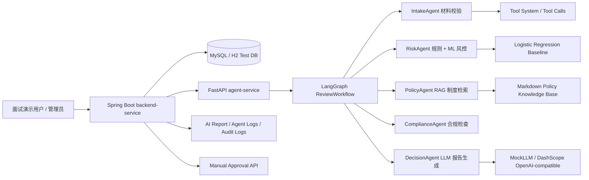

# Architecture

## 第 9 轮：Tool Trace E2E 与高风险复核分支

本轮在第 8 轮 tool system 基础上补齐“Python 结构化工具调用 -> Java 日志摘要 -> Demo UI 展示”的端到端可观测链路，同时将高风险申请显式路由到高级人工复核要求分支。

```text
START -> intake -> route_after_intake
  missing_materials -> policy -> compliance -> decision -> END
  ready_for_risk -> risk -> route_after_risk
    high_risk -> senior_review -> policy -> compliance -> decision -> END
    normal_risk -> policy -> compliance -> decision -> END
```

`SeniorReviewAgent` 调用 `SeniorReviewChecklistTool`，只输出 `senior_review_required=true` 和 `senior_review_reasons`。它不修改风险评分、不写最终审批状态、不替代人工 senior reviewer；DecisionAgent 和 ComplianceAgent 只把 senior review 要求纳入辅助理由与合规提示。

Tool trace 流转如下：

```text
agent-service AgentResult.result.tool_calls
        -> backend-service AgentReviewService output_summary short tools=...
        -> demo.html Agent Logs timeline structured tool cards
```

Java 侧不新增表字段，只在 `agent_execution_log.output_summary` 中追加短摘要，例如 `tools=RiskRuleTool:SUCCESS(3ms), RiskModelTool:FAILED(5ms,error=...)`，避免保存完整工具输出。Demo 页面优先读取最近一次 AI Review 响应里的结构化 `tool_calls`；查询 Java logs 时，如果日志本身只有摘要，也会用 workflow 中同名 Agent 的最新结构化结果补充展示。

## 第 8 轮：Tool System 与条件路由

本轮将 Python Agent 服务从“线性 Agent 类调用”升级为“Agent 编排 + 显式 Tool 能力 + Tool trace”。每个 Agent 仍代表一个审批角色，但具体能力由工具承载：

- `MaterialChecklistTool`：材料完整性校验。
- `RiskRuleTool`：规则风控评分。
- `RiskModelTool`：Logistic Regression baseline 辅助信号，失败时返回 `model_used=false`。
- `PolicySearchTool`：本地 TF-IDF 制度检索。
- `ComplianceGuardrailTool`：AI/ML/RAG/LLM 审批边界与审计提示。
- `ReportGenerationTool`：包装 LLM 报告生成和 fallback。

`AgentResult.result.tool_calls` 会记录工具名、状态、输入/输出摘要、开始/结束时间、耗时和错误信息。这里的 tool calling 是工程侧可观测工具调用，不等于让 LLM 随意调用写库工具；LLM 不拥有 approve/reject/need-more-info 权限，最终审批仍只能由 Java 人工审批接口写入。

LangGraph workflow 现在包含材料缺失条件分支：

```text
START -> intake
  if required_materials not empty:
      policy -> compliance -> decision -> END
  else:
      risk -> policy -> compliance -> decision -> END
```

材料缺失时跳过 RiskAgent，避免用无效收入、额度或期限做风控计算；工作流写入保守默认值 `risk_score=0`、`risk_level=HIGH`、`suggested_amount=0`，并在 `risk_assessment` 中标记 `risk_skipped=true`。DecisionAgent 会输出 `NEED_MORE_INFO`，仍保留制度引用、合规提示和 tool trace。后续可以在 risk 后继续扩展高风险 senior review 分支。

Java 人工审批状态机也进一步收紧：approve/reject 只允许从 `AI_REVIEWED` 进入；need-more-info 只允许从 `SUBMITTED` 或 `AI_REVIEWED` 进入；`DRAFT` 和终态不能直接或重复人工审批。

## 第 6 轮面试版架构总览



## Java 后端职责

- 客户管理：保存脱敏客户信息，不使用真实身份证、手机号或银行客户数据。
- 贷款申请：创建、提交、查询贷款申请。
- 状态流转：AI review 后最多进入 `AI_REVIEWED`，最终状态必须走人工审批。
- 触发 AI review：通过 HTTP 调用 Python `/api/v1/reviews`。
- 保存 AI report：将结构化 report JSON 入库，保留 risk、policy references 和 decision reasons。
- 保存 Agent execution logs：记录 Agent 名称、状态、耗时、输入/输出摘要和 LLM 生成元信息摘要。
- 人工审批：通过 approve/reject/need-more-info 接口写最终状态。
- 审计日志：记录登录、AI review、人工审批等关键操作。

## Python Agent 服务职责

- LangGraph 编排：按条件路由执行 IntakeAgent、RiskAgent、PolicyAgent、ComplianceAgent、DecisionAgent；材料缺失时跳过 RiskAgent。
- IntakeAgent：检查申请材料和基础字段完整性。
- RiskAgent：融合规则评分和 Logistic Regression baseline。
- PolicyAgent：基于本地 Markdown 制度库做 TF-IDF RAG 检索。
- ComplianceAgent：生成合规提示，强调 AI/ML 只作辅助。
- DecisionAgent：通过 LLM Provider 生成报告文本，并保留 fallback。
- Tool trace：每个成功执行的 Agent 在 `AgentResult.result.tool_calls` 中保留工具调用记录。
- LLM Provider：默认 Mock，可选 DashScope OpenAI-compatible，本地显式开启才会调用真实服务。

## 为什么是双服务架构

Java 更适合承载业务系统、权限、审批流程、数据库事务和审计留痕；Python 更适合 AI/ML/RAG/LangGraph 生态。两个服务通过 HTTP API 解耦，便于独立测试、独立替换 Agent 能力，也符合企业中 Java 业务系统接入 Python AI 服务的常见工程形态。

## 为什么用 LangGraph 而不只是 LangChain

LangGraph 适合状态化、多节点、可观测、可扩展的工作流编排；LangChain 更适合作为 LLM、retriever、embedding、tool 等组件集成层。本项目用 LangGraph 管理审批 Agent 流程，用可替换服务类预留 LangChain 生态组件接入能力。当前面试版使用固定顺序 workflow，后续可加入高风险、材料缺失、合规异常等 conditional edge。

## 审批边界

AI/ML/RAG/LLM 输出只作为审批辅助建议。系统不会让 LLM 改写 `risk_score`、`risk_level` 或数据库最终审批状态；最终 `APPROVED`、`REJECTED`、`NEED_MORE_INFO` 必须由人工审批接口确认。

## 双服务架构

SmartCreditMultiAgent 使用双服务架构：

- `backend-service`：Spring Boot 信贷业务系统，负责业务状态、持久化、审计和人工审批。
- `agent-service`：FastAPI + LangGraph 多 Agent 审批辅助服务，负责生成结构化 AI 审批建议。

## Java 后端职责

- 用户登录、JWT 和基础角色结构。
- 客户信息管理，只保存脱敏身份证和脱敏手机号。
- 贷款申请生命周期管理。
- 调用 Python Agent 服务。
- 保存 AI 审批报告、Agent 执行日志、人工审批记录和审计日志。
- 通过人工审批接口完成最终状态变更。

## Python Agent 服务职责

- 接收客户和贷款申请结构化信息。
- 使用 LangGraph 编排 `IntakeAgent -> RiskAgent -> PolicyAgent -> ComplianceAgent -> DecisionAgent`。
- 返回 `workflow_id`、风险等级、风险分、建议额度、摘要、Agent 执行结果和报告。

## 数据流

```text
Client -> backend-service -> MySQL
                       |
                       v
                 agent-service
                       |
                       v
        LangGraph multi-agent workflow
                       |
                       v
backend-service saves report/logs/audit and returns result
```

## 为什么用 LangGraph

LangGraph 适合表达有状态、多节点、可扩展条件分支的审批流程。第一轮使用固定顺序工作流，后续可在材料缺失、高风险、合规警告等节点加入 conditional edge。LangChain 只作为后续 LLM、Embedding、Retriever、向量库和结构化输出的组件集成层。
